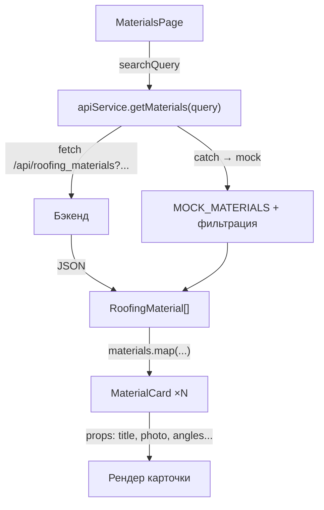

# Документация: фильтрация, компоненты, props, хуки и fetch

## Оглавление

1. [Общая архитектура потока данных](#1-общая-архитектура-потока-данных)
2. [Типы данных (TypeScript-интерфейсы)](#2-типы-данных)
3. [API-сервис и fetch-запросы](#3-api-сервис-и-fetch-запросы)
4. [Страница со списком и фильтрацией — MaterialsPage](#4-materialspage)
5. [Компонент карточки — MaterialCard](#5-materialcard)
6. [Custom hook — useImageFallback](#6-useimagefallback)
7. [Страница деталей — MaterialDetailPage](#7-materialdetailpage)

---

## 1. Общая архитектура потока данных



Пользователь вводит запрос → [MaterialsPage](file:///Users/l.poljakov/Documents/BMSTU/Development%20of%20internet%20applications/Development-of-Internet-Applications-Frontend/src/pages/MaterialsPage.tsx#9-83) передаёт его в `apiService` → `fetch` отправляет запрос на бэкенд → при ошибке используются mock-данные с локальной фильтрацией → результат отображается через массив компонентов [MaterialCard](file:///Users/l.poljakov/Documents/BMSTU/Development%20of%20internet%20applications/Development-of-Internet-Applications-Frontend/src/components/MaterialCard.tsx#7-45).

---

## 2. Типы данных

Файл [types.ts](file:///Users/l.poljakov/Documents/BMSTU/Development%20of%20internet%20applications/Development-of-Internet-Applications-Frontend/src/types.ts) определяет TypeScript-интерфейсы для всего приложения:

```typescript
// Краткая модель материала — используется в списке (MaterialCard)
export interface RoofingMaterial {
  roofing_material_id: number;
  title: string;
  min_tilt_angle: number;
  max_tilt_angle: number;
  photo: string;               // URL картинки, может быть пустым ""
}

// Расширенная модель — используется на странице деталей
export interface RoofingMaterialDetail {
  roofing_material_id: number;
  title: string;
  description: string;         // подробное описание
  min_tilt_angle: number;
  max_tilt_angle: number;
  photo: string;
  video_url: string;           // ссылка на видео
}

// Обёртка ответа API для списка материалов
export interface RoofingMaterialsListResponse {
  roofing_materials: RoofingMaterial[];
}

// Информация о черновике заявки (для кнопки OrderButton)
export interface DraftCalculationInfo {
  tilt_angle_calculation_id: number;
  roofing_materials_count: number;
}
```

> [!NOTE]
> [RoofingMaterial](file:///Users/l.poljakov/Documents/BMSTU/Development%20of%20internet%20applications/Development-of-Internet-Applications-Frontend/src/types.ts#1-8) — это «лёгкая» версия без `description` и `video_url`. [RoofingMaterialDetail](file:///Users/l.poljakov/Documents/BMSTU/Development%20of%20internet%20applications/Development-of-Internet-Applications-Frontend/src/types.ts#9-18) добавляет эти два поля и используется только при просмотре конкретного материала.

---

## 3. API-сервис и fetch-запросы

Файл [api.ts](file:///Users/l.poljakov/Documents/BMSTU/Development%20of%20internet%20applications/Development-of-Internet-Applications-Frontend/src/services/api.ts) содержит все HTTP-запросы. Каждый метод:
1. **Пытается** сделать реальный `fetch` к бэкенду
2. **При ошибке** (сеть недоступна, сервер не отвечает) — возвращает mock-данные

### 3.1. Получение списка с фильтрацией — [getMaterials](file:///Users/l.poljakov/Documents/BMSTU/Development%20of%20internet%20applications/Development-of-Internet-Applications-Frontend/src/services/api.ts#226-249)

```typescript
async getMaterials(query: string): Promise<RoofingMaterial[]> {
  try {
    // 1. Формируем query-параметры для бэкенда
    const params = new URLSearchParams();
    if (query) params.append("roofing_material", query);

    // 2. Выполняем GET /api/roofing_materials?roofing_material=...
    const response = await fetch(`${API_BASE_URL}/roofing_materials?${params}`);

    if (!response.ok) {
      throw new Error(`HTTP error! status: ${response.status}`);
    }

    // 3. Парсим JSON, извлекаем массив из обёртки
    const data: RoofingMaterialsListResponse = await response.json();
    return data.roofing_materials;
  } catch {
    // 4. Fallback на mock-данные с ЛОКАЛЬНОЙ фильтрацией
    let mockMaterials = [...MOCK_MATERIALS];
    if (query) {
      mockMaterials = mockMaterials.filter((m) =>
        m.title.toLowerCase().includes(query.toLowerCase())
      );
    }
    return mockMaterials;
  }
}
```

**Ключевые моменты:**
- Параметр `query` передаётся на бэкенд через `URLSearchParams` → фильтрация происходит **на сервере**
- При недоступности сервера — `catch` перехватывает ошибку и фильтрует **локальный** массив `MOCK_MATERIALS` по `title`
- `filter()` ищет подстроку **регистронезависимо** (`toLowerCase()`)
- Возвращается `Promise<RoofingMaterial[]>` — асинхронный массив материалов

### 3.2. Получение одного материала — [getMaterialById](file:///Users/l.poljakov/Documents/BMSTU/Development%20of%20internet%20applications/Development-of-Internet-Applications-Frontend/src/services/api.ts#250-264)

```typescript
async getMaterialById(id: number): Promise<RoofingMaterialDetail | null> {
  try {
    // GET /api/roofing_materials/1
    const response = await fetch(`${API_BASE_URL}/roofing_materials/${id}`);

    if (!response.ok) {
      if (response.status === 404) return null;  // материал не найден
      throw new Error(`HTTP error! status: ${response.status}`);
    }

    return await response.json();
  } catch {
    // Fallback: ищем в mock-словаре по ID
    return MOCK_MATERIAL_DETAILS[id] || null;
  }
}
```

**Особенности:**
- Возвращает `null`, если материал не найден (404 или отсутствует в mock'ах)
- `MOCK_MATERIAL_DETAILS` — это `Record<number, RoofingMaterialDetail>`, т.е. словарь по ID

### 3.3. Получение черновика заявки — [getDraftCalculation](file:///Users/l.poljakov/Documents/BMSTU/Development%20of%20internet%20applications/Development-of-Internet-Applications-Frontend/src/services/api.ts#265-283)

```typescript
async getDraftCalculation(): Promise<DraftCalculationInfo> {
  try {
    const response = await fetch(
      `${API_BASE_URL}/roof_angle_calculation/current_tilt_calculation`
    );

    if (!response.ok) {
      return { tilt_angle_calculation_id: -1, roofing_materials_count: 0 };
    }

    return await response.json();
  } catch {
    return MOCK_DRAFT_CALCULATION;
  }
}
```

Используется компонентом [OrderButton](file:///Users/l.poljakov/Documents/BMSTU/Development%20of%20internet%20applications/Development-of-Internet-Applications-Frontend/src/components/OrderButton.tsx#11-54) для проверки наличия активной заявки.

---

## 4. MaterialsPage

[MaterialsPage.tsx](file:///Users/l.poljakov/Documents/BMSTU/Development%20of%20internet%20applications/Development-of-Internet-Applications-Frontend/src/pages/MaterialsPage.tsx) — основная страница со списком материалов и поиском.

### 4.1. State-переменные (хуки `useState`)

```typescript
const [materials, setMaterials] = useState<RoofingMaterial[]>([]);  // список материалов
const [loading, setLoading]     = useState<boolean>(true);           // индикатор загрузки
const [searchQuery, setSearchQuery] = useState<string>("");          // текст поискового запроса
```

| Переменная | Тип | Начальное значение | Назначение |
|------------|-----|--------------------|------------|
| `materials` | `RoofingMaterial[]` | `[]` | Массив материалов для отображения |
| `loading` | `boolean` | `true` | Управляет показом спиннера |
| `searchQuery` | `string` | `""` | Текущий введённый поисковый запрос |

### 4.2. Загрузка данных (`useEffect` + [loadMaterials](file:///Users/l.poljakov/Documents/BMSTU/Development%20of%20internet%20applications/Development-of-Internet-Applications-Frontend/src/pages/MaterialsPage.tsx#18-29))

```typescript
// Вызывается ОДИН раз при монтировании компонента ([] — пустые зависимости)
useEffect(() => {
  loadMaterials();
}, []);

const loadMaterials = async () => {
  try {
    setLoading(true);                                      // показать спиннер
    const data = await apiService.getMaterials(searchQuery); // fetch к API
    setMaterials(data);                                    // записать результат в state
  } catch (err) {
    console.error("Error loading materials:", err);
  } finally {
    setLoading(false);                                     // убрать спиннер в любом случае
  }
};
```

**Как работает `useEffect`:**
- Второй аргумент `[]` (пустой массив зависимостей) означает, что эффект выполнится **только один раз** — при первом рендере (монтировании) компонента
- Внутри вызывается [loadMaterials()](file:///Users/l.poljakov/Documents/BMSTU/Development%20of%20internet%20applications/Development-of-Internet-Applications-Frontend/src/pages/MaterialsPage.tsx#18-29), которая читает текущее значение `searchQuery` из замыкания

### 4.3. Обработчик формы поиска

```typescript
const handleSearchSubmit = (e: FormEvent) => {
  e.preventDefault();    // предотвращаем перезагрузку страницы
  loadMaterials();       // повторно загружаем данные с текущим searchQuery
};
```

Когда пользователь нажимает «Найти» (или Enter в поле), форма вызывает [handleSearchSubmit](file:///Users/l.poljakov/Documents/BMSTU/Development%20of%20internet%20applications/Development-of-Internet-Applications-Frontend/src/pages/MaterialsPage.tsx#30-34) → [loadMaterials()](file:///Users/l.poljakov/Documents/BMSTU/Development%20of%20internet%20applications/Development-of-Internet-Applications-Frontend/src/pages/MaterialsPage.tsx#18-29) → `apiService.getMaterials(searchQuery)` с актуальным текстом запроса.

### 4.4. JSX: условный рендеринг трёх состояний

```tsx
{/* 1. Загрузка — спиннер */}
{loading && (
  <div className="page-materials__loader">
    <Spinner animation="border" role="status" variant="light">
      <span className="visually-hidden">Загрузка...</span>
    </Spinner>
  </div>
)}

{/* 2. Пусто — ничего не найдено */}
{!loading && materials.length === 0 && (
  <div className="page-materials__empty">
    <p>Материалы не найдены</p>
  </div>
)}

{/* 3. Есть данные — сетка карточек */}
{!loading && materials.length > 0 && (
  <div className="page-materials__grid">
    {materials.map((material) => (
      <MaterialCard key={material.roofing_material_id} {...material} />
    ))}
  </div>
)}
```

> [!IMPORTANT]
> `{...material}` — spread-оператор, который передаёт **все поля** объекта [RoofingMaterial](file:///Users/l.poljakov/Documents/BMSTU/Development%20of%20internet%20applications/Development-of-Internet-Applications-Frontend/src/types.ts#1-8) как отдельные props: `roofing_material_id`, `title`, `min_tilt_angle`, `max_tilt_angle`, `photo`.

---

## 5. MaterialCard

[MaterialCard.tsx](file:///Users/l.poljakov/Documents/BMSTU/Development%20of%20internet%20applications/Development-of-Internet-Applications-Frontend/src/components/MaterialCard.tsx) — компонент карточки одного материала.

### 5.1. Props (передаваемые свойства)

```typescript
// Интерфейс props наследует все поля RoofingMaterial
interface MaterialCardProps extends RoofingMaterial { }

const MaterialCard: React.FC<MaterialCardProps> = ({
  roofing_material_id,   // ID материала — для формирования ссылки
  title,                 // Название — отображается как заголовок
  min_tilt_angle,        // Мин. угол наклона
  max_tilt_angle,        // Макс. угол наклона
  photo,                 // URL фото — может быть пустой строкой ""
}) => {
```

| Prop | Тип | Пример | Использование |
|------|-----|--------|---------------|
| `roofing_material_id` | `number` | `1` | `<Link to={'/materials/1'}>` |
| `title` | `string` | `"Металлочерепица"` | Текст в `<h3>` |
| `min_tilt_angle` | `number` | `24` | `min ∠: 24°` |
| `max_tilt_angle` | `number` | `90` | `max ∠: 90°` |
| `photo` | `string` | URL или `""` | `` или placeholder |

### 5.2. Custom hook и fallback-изображение

```typescript
const { imageError, handleImageError } = useImageFallback();
```

```tsx
{photo && !imageError ? (
  // Есть URL и изображение не сломано → показываем фото
    // при ошибке → fallback
) : (
  // Нет URL или изображение недоступно → показываем placeholder
  <div className="material-card__placeholder">
    
  </div>
)}
```

**Логика:**
1. Если `photo` — непустая строка **и** `imageError === false` → рендерим ``
2. Если `photo` пуст или изображение не загрузилось (`onError` → `imageError = true`) → показываем SVG-логотип как заглушку

---

## 6. useImageFallback

[useImageFallback.ts](file:///Users/l.poljakov/Documents/BMSTU/Development%20of%20internet%20applications/Development-of-Internet-Applications-Frontend/src/hooks/useImageFallback.ts) — custom hook, вынесенный из трёх компонентов.

```typescript
import { useState, useCallback } from "react";

export function useImageFallback() {
  const [imageError, setImageError] = useState(false);

  // useCallback мемоизирует функцию, чтобы не создавать новый объект при каждом рендере
  const handleImageError = useCallback(() => {
    setImageError(true);
  }, []);

  const resetImageError = useCallback(() => {
    setImageError(false);
  }, []);

  return { imageError, handleImageError, resetImageError };
}
```

| Возвращаемое значение | Тип | Назначение |
|-|--|--|
| `imageError` | `boolean` | Флаг: загрузка изображения не удалась |
| `handleImageError` | [() => void](file:///Users/l.poljakov/Documents/BMSTU/Development%20of%20internet%20applications/Development-of-Internet-Applications-Frontend/src/App.tsx#8-25) | Передаётся в `onError` тега `` |
| `resetImageError` | [() => void](file:///Users/l.poljakov/Documents/BMSTU/Development%20of%20internet%20applications/Development-of-Internet-Applications-Frontend/src/App.tsx#8-25) | Сброс при загрузке нового материала |

**Используется в:** [MaterialCard](file:///Users/l.poljakov/Documents/BMSTU/Development%20of%20internet%20applications/Development-of-Internet-Applications-Frontend/src/components/MaterialCard.tsx#7-45), [MaterialDetailModal](file:///Users/l.poljakov/Documents/BMSTU/Development%20of%20internet%20applications/Development-of-Internet-Applications-Frontend/src/components/MaterialDetailModal.tsx#10-62), [MaterialDetailPage](file:///Users/l.poljakov/Documents/BMSTU/Development%20of%20internet%20applications/Development-of-Internet-Applications-Frontend/src/pages/MaterialDetailPage.tsx#52-199)

---

## 7. MaterialDetailPage

[MaterialDetailPage.tsx](file:///Users/l.poljakov/Documents/BMSTU/Development%20of%20internet%20applications/Development-of-Internet-Applications-Frontend/src/pages/MaterialDetailPage.tsx) — страница детальной информации о материале.

### 7.1. Получение параметра URL

```typescript
const { id } = useParams<{ id: string }>();  // из /materials/:id
```

Хук `useParams` из `react-router-dom` извлекает динамический сегмент `:id` из URL. Например, для `/materials/5` значение [id](file:///Users/l.poljakov/Documents/BMSTU/Development%20of%20internet%20applications/Development-of-Internet-Applications-Frontend/src/pages/MaterialDetailPage.tsx#89-96) будет `"5"` (строка).

### 7.2. Загрузка данных

```typescript
useEffect(() => {
  if (!id || isNaN(parseInt(id))) {
    navigate("/", { replace: true });  // некорректный ID → редирект на главную
    return;
  }
  loadMaterial(parseInt(id));            // валидный ID → загрузка
}, [id, navigate]);                      // при смене id перезагружаем
```

```typescript
const loadMaterial = async (materialId: number) => {
  try {
    setLoading(true);
    const data = await apiService.getMaterialById(materialId);
    if (!data) {
      navigate("/", { replace: true });  // материал не найден → редирект
      return;
    }
    setMaterial(data);
    setVideoFallbackUsed(false);
    setVideoError(false);
    resetImageError();                   // сброс ошибки изображения
  } catch {
    navigate("/", { replace: true });
  } finally {
    setLoading(false);
  }
};
```

**Зависимости `useEffect`:** `[id, navigate]` — эффект перезапускается при смене [id](file:///Users/l.poljakov/Documents/BMSTU/Development%20of%20internet%20applications/Development-of-Internet-Applications-Frontend/src/pages/MaterialDetailPage.tsx#89-96) в URL (например, при навигации с `/materials/1` на `/materials/2`).

### 7.3. Подкомпонент OverlayContent

Вынесен для устранения дублирования ~30 строк JSX:

```typescript
interface OverlayContentProps {
  material: RoofingMaterialDetail;
  imageError: boolean;
  onImageError: () => void;
  onTitleClick: () => void;
}

const OverlayContent: React.FC<OverlayContentProps> = ({
  material, imageError, onImageError, onTitleClick,
}) => (
  <div className="page-material-detail-vertical__overlay-content">
    {material.photo && !imageError ? (
      
    ) : (
      <div className="..."></div>
    )}
    <div className="...">
      <h3 onClick={onTitleClick}>{material.title}</h3>
      <div>
        <span>min ∠: {material.min_tilt_angle}°</span>
        <span>max ∠: {material.max_tilt_angle}°</span>
      </div>
    </div>
  </div>
);
```

| Prop | Тип | Откуда передаётся |
|------|-----|-------------------|
| `material` | [RoofingMaterialDetail](file:///Users/l.poljakov/Documents/BMSTU/Development%20of%20internet%20applications/Development-of-Internet-Applications-Frontend/src/types.ts#9-18) | State из [MaterialDetailPage](file:///Users/l.poljakov/Documents/BMSTU/Development%20of%20internet%20applications/Development-of-Internet-Applications-Frontend/src/pages/MaterialDetailPage.tsx#52-199) |
| `imageError` | `boolean` | Из [useImageFallback()](file:///Users/l.poljakov/Documents/BMSTU/Development%20of%20internet%20applications/Development-of-Internet-Applications-Frontend/src/hooks/useImageFallback.ts#3-16) |
| `onImageError` | [() => void](file:///Users/l.poljakov/Documents/BMSTU/Development%20of%20internet%20applications/Development-of-Internet-Applications-Frontend/src/App.tsx#8-25) | `handleImageError` из хука |
| `onTitleClick` | [() => void](file:///Users/l.poljakov/Documents/BMSTU/Development%20of%20internet%20applications/Development-of-Internet-Applications-Frontend/src/App.tsx#8-25) | Открытие модального окна |
